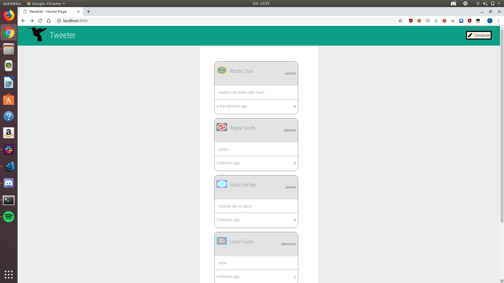
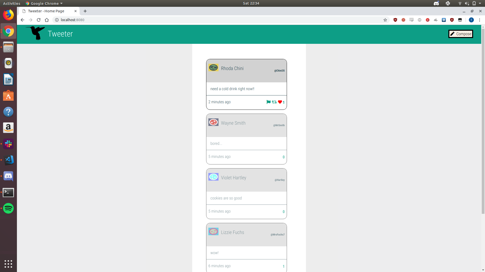
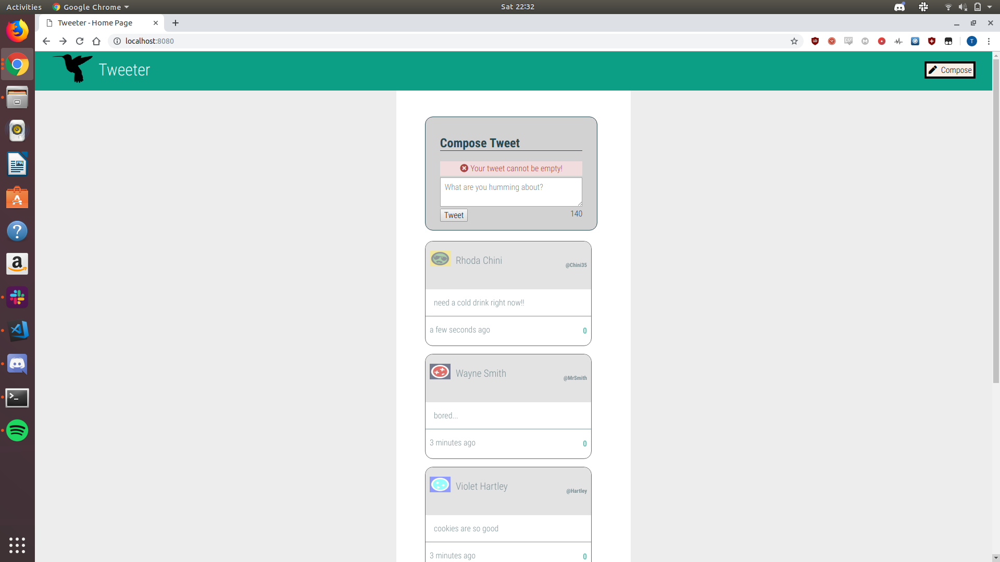

# Tweeter Project

Tweeter is a simple, single-page Twitter clone.

This repository is the starter code for the project: Students will fork and clone this repository, then build upon it to practice their HTML, CSS, JS, jQuery and AJAX front-end skills, and their Node, Express and MongoDB back-end skills.

## Final Product

## Getting Started

1. Fork this repository, then clone your fork of this repository.
2. Install dependencies using the `npm install` command.
3. Start the web server using the `npm run local` command. The app will be served at <http://localhost:8080/>.
4. Go to <http://localhost:8080/> in your browser.

## Dependencies

- Express
- Node 5.10.x or above
- MongoDB
- Chance
- MD5

## Project Requirements

## Functional Requirements
- Primarily a client-side Single Page App (SPA)
- The client-side app communicates with a server via AJAX
- Tweets are persisted to MongoDB and survive server restart

### Display Requirements
Navigation Bar:

- is fixed to the top :white_check_mark:
- has padding on both sides :white_check_mark:
- contains Compose button :white_check_mark:

Compose Tweet box:

- is displayed above the list of tweets :white_check_mark:
- is hidden on page load :white_check_mark:
- contains a form for submitting tweets, which itself contains:
    - a textarea for new tweet content :white_check_mark:
    - a left-aligned button for submitting new tweets :white_check_mark:
    - contains a Character Counter, right-aligned, which by default shows   140 :white_check_mark:s

List of Tweets:

- displays tweets in reverse-chronological order (that is, by       creation time descending) :white_check_mark:

Individual Tweets:

- have a header, which contains the user's:
    - avatar, on the left :white_check_mark:
    - name, on the left and after the avatar :white_check_mark:
    - handle, on the right :white_check_mark:
- have a body, which contains the tweet text :white_check_mark:
- have a footer, which displays:
    - how long ago the tweet was created, on the left :white_check_mark:
    - "Flag", "Re-tweet" and "Like" icons upon hovering over the tweet,  on the right :white_check_mark:

### Behaviour

Navigation Bar
- When a user clicks the Compose button in the Navigation Bar:
- if the Compose Tweet box is currently hidden, then it is shown, and the textarea inside it is auto-focused :white_check_mark:
- if the Compose Tweet box is currently showing, then it is hidden
in either case, transitions between 'shown' and 'hidden' states should be animated :white_check_mark:

Character Counter
- When a user types into the Compose Tweet textarea, the Character Counter is updated to show how many characters a user may still type (subtracting the number of characters they've typed from the maximum allowable character count of 140) :white_check_mark:

- The Character Counter turns red (or similar) when more than 140 characters have been typed into the Compose Tweet textarea, and it shows how many characters over the 140 limit have been typed (using a negative number) :white_check_mark:

Compose Tweet
- When a user submits an invalid tweet (the tweet textarea is empty or contains more than 140 characters), an appropriate error message is displayed :white_check_mark:

- When a user submits a valid tweet, the list of tweets is refreshed (displaying the new tweet), the Compose Tweet textarea is cleared, and the Character Counter is reset (to 140) :white_check_mark:

### Stretch
- When a user clicks a tweet's "Like" button, the "Like" count is updated :white_check_mark:

- Only logged-in users may "like" tweets, and they may not "like" their own tweets
